The 26 Best Travel Booking Sites for 2025

 Are you sick of having to switch between a dozen tabs just to plan one trip?  It can seem like a full-time job to find the best prices on flights, hotels, and things to do.  You need an easy way to look at your options, get the best prices, and keep track of your schedule without getting a headache.  This carefully chosen list of the best travel booking sites will help you plan your trips more quickly and easily.

 ***

 ## **[Booking.com](https://www.booking.com)**

 The best place to find almost any kind of place to stay in the world.

 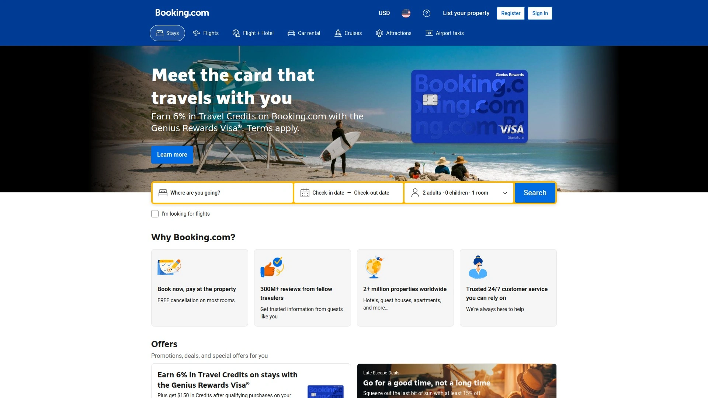

 Booking.com is the biggest name in online travel. It has over 28 million listings, including five-star hotels, cozy apartments, and unique homestays.  Its size and easy-to-use interface are what make it strong.  The "Genius" loyalty program gives you bigger discounts and perks the more you book, which is a way to reward repeat customers.

 In 2025, Booking.com used a lot of AI to make it easier to plan trips.  * **Smart Filter:** This new feature lets you search using natural language, like "a quiet hotel in Paris with a balcony and a good breakfast," to get very relevant results without having to check boxes.
 * **AI Trip Support:** A virtual assistant that is available 24/7 to quickly answer questions about a property or help you with your reservation.
 * **Upfront Pricing:** The platform now shows the total price, including all required fees, from the start of your search to follow new rules. This means you won't have any surprise charges at checkout.

 ## **[Expedia](https://www.expedia.com)**

 The best way to save money on flights, hotels, and car rentals is to put them all together.

 

 There is a reason why people know about Expedia.  As a key part of the Expedia Group, it makes use of a huge network that includes over 3 million properties and 500 airlines.  The best thing about it is that you can save a lot of money by putting different parts of your trip together.  The platform's interface makes it easy to compare flight and hotel packages, which can save you hundreds of dollars compared to booking them separately.

 ## **[Tripadvisor](https://www.tripadvisor.com)**

 The biggest travel advice site in the world, with more than a billion user reviews.

 Tripadvisor is well-known for its reviews, but it has also become a great way to book things.  You can book hotels, find tours, and make reservations at restaurants all from the same place.  Its main value comes from the huge amount of user-generated content, which lets you see almost any place or property without any filters before you book.  It's the best way to check that the place you book lives up to its promises and to compare different options.

 ## **[Skyscanner](https://www.skyscanner.com)**

 A strong and adaptable meta-search engine that helps you find the best deals on flights.

 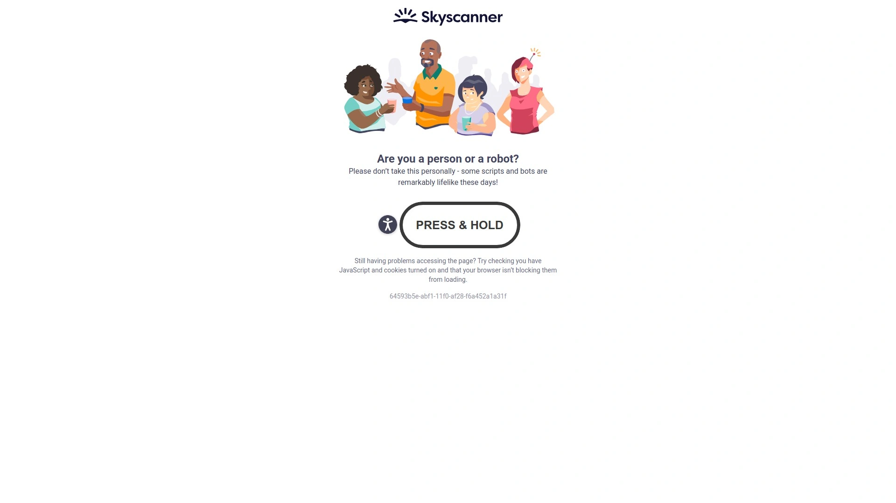

 For budget travelers, Skyscanner is the best friend.  It looks through more than 1,200 travel companies to find the best prices on hotels, flights, and car rentals.  The "Whole Month" search is the best part. It shows you flight prices for a whole month, so you can quickly find the cheapest days to fly.  It only gives you information and sends you to the airline or travel agent to book, making sure you see the final price without any extra charges.

 ## **[Travelocity](https://www.travelocity.com)**

 An expert in vacation packages with a booking process that is easy to use.

 Travelocity is a part of the Expedia Group and is great at putting together vacation packages that work well together.  This is the site for you if you want to book a flight, hotel, and car for a week-long vacation in just a few clicks.  The interface is simple and easy to use, and members can get discounts of 10% or more on some hotels.

 ## **[Kayak](https://www.kayak.com)**

 A meta-search engine that looks through billions of queries to find the best travel deals.

 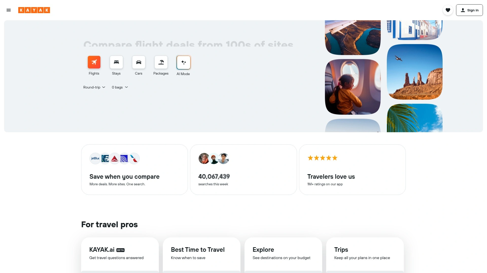

 Kayak, like Skyscanner, doesn't sell anything directly.  It looks through hundreds of other travel sites to show you all of your options in one place.  Booking Holdings owns it, and it's known for its easy-to-use interface and powerful filtering tools, like price alerts that let you know when fares on your desired route go down.  It is an important tool for travelers who want to make sure they aren't paying too much.

 ## **[Agoda](https://www.agoda.com)**

 A top travel website, especially in Asia.

 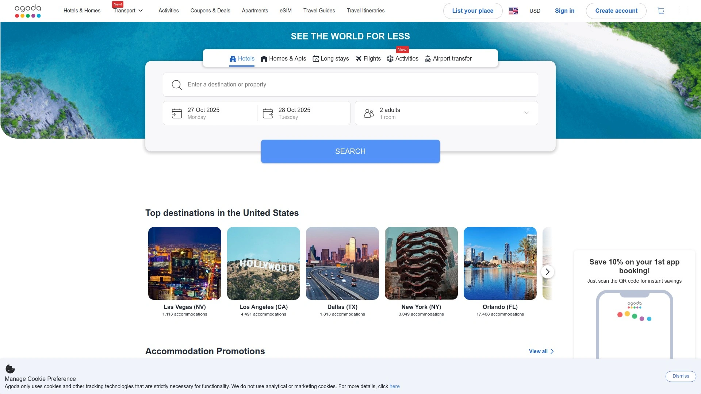

 Agoda is also part of the Booking Holdings family. It is known for having a large number of properties in Asia and for offering deals that you can't find anywhere else.  Agoda is a good place to look for hotels, resorts, and private homes at good prices if you're going anywhere from Tokyo to Bali.

 ## **[Vrbo](https://www.vrbo.com)**

 The best place to find vacation rentals like cabins, condos, and houses.

 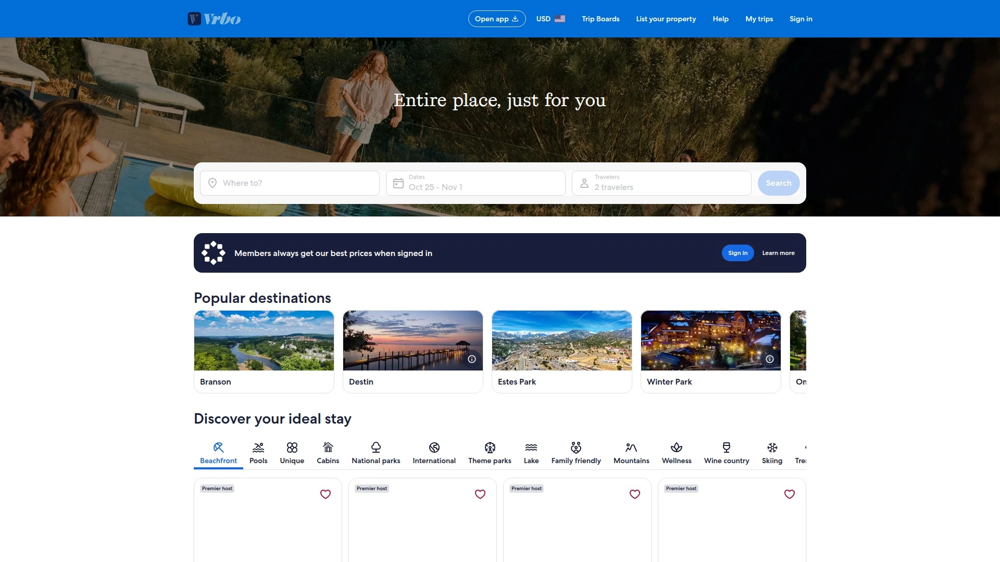

 Vrbo (Vacation Rentals by Owner) is a great choice for families and groups because it specializes in renting out entire homes.  Vrbo is different from other sites because it gives you an entire space to yourself instead of just a single room.  Expedia Group owns it, and it's a good option for travelers who would rather stay in a home than a hotel.

 **[Priceline](https://www.priceline.com)**

 The king of unclear deals that give flexible travelers big savings.

 "Name Your Own Price" and "Express Deals" are two of Priceline's most popular features. They let you save a lot of money on hotels and rental cars if you're okay with not knowing the exact brand until after you pay.  This model is great for last-minute trips or for people who want to save money over staying at a certain hotel chain.

 **[Orbitz](https://www.orbitz.com)**

 A full-service travel booking site with a great loyalty program.

 Orbitz is another member of the Expedia Group family. Its loyalty program, Orbitz Rewards, is simple and works well.  You get "Orbucks" for making reservations, which you can use right away on your next hotel stay.  The platform is also known for being one of the first to actively promote hotels that are friendly to LGBTQIA people, so anyone can feel welcome there.

 ## **[Hotels.com](https://www.hotels.com)** 

 A simple site for booking hotels with a rewards program that is easy to understand.

 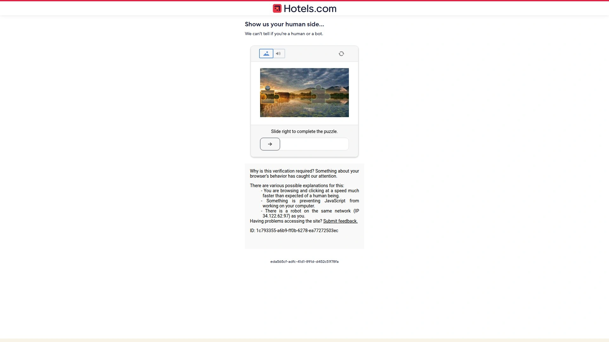

 Hotels.com is all about places to stay, as the name suggests.  The "Rewards" program is what makes it so appealing: book ten nights and get one free.  This ease of use has made it a favorite among frequent travelers who want a loyalty benefit that is easy to use without having to deal with complicated point systems.

 ## **[Hostelworld](https://www.hostelworld.com)**

 The best place for budget-conscious travelers to find and book hostels around the world.

 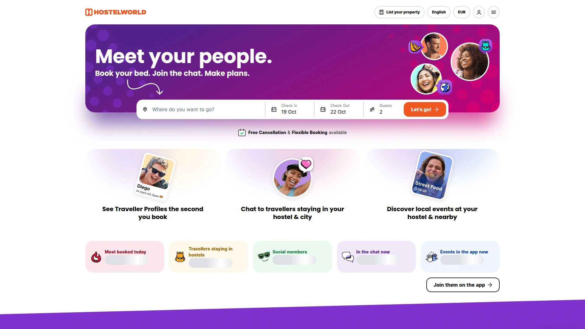

 Hostelworld is a must-have for people who travel alone or with a backpack.  It has a huge list of hostels in more than 170 countries, along with detailed reviews, ratings, and social features that let you meet other travelers.  It's the best place to look for cheap and social places to stay.

 ## **[Hotwire](https://www.hotwire.com)**

 A booking site that is hard to see through and gives big discounts on last-minute trips.

 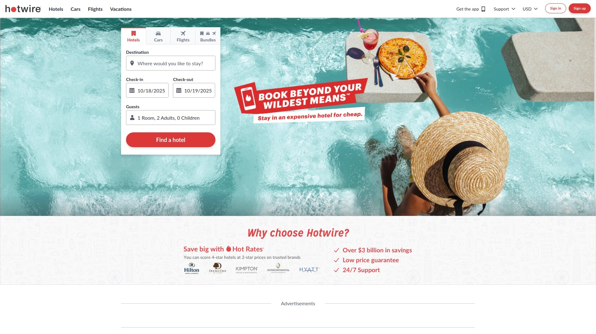

 Hotwire has "Hot Rate" deals, just like Priceline, where you don't find out the name of the hotel until after you book.  This lets high-end hotels sell their empty rooms at a big discount without having to lower their prices in public.  It's a great choice for trips you need to take at the last minute when you can change your plans.

 ## **[Momondo](https://www.momondo.com)

 A meta-search engine that looks good and is great at comparing prices.

 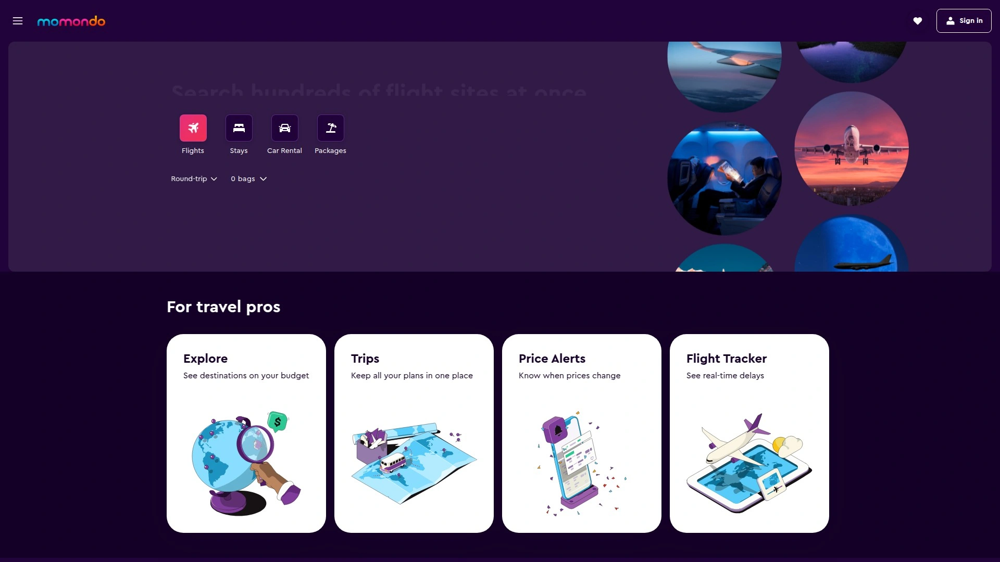

 Momondo is a part of the Kayak family of websites. Its colorful and easy-to-use interface makes it easier to find cheap flights.  It has a price tracker and strong filtering to help you choose the best time to book.

 **[Trip.com](https://www.trip.com)**

 A travel agency that works all over the world and has a lot of connections in Asia.

 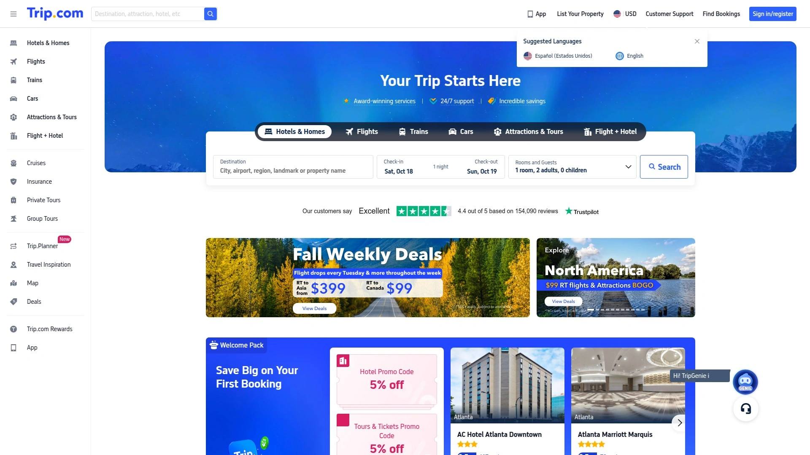

 Trip.com, which used to be called Ctrip, is now one of the biggest online travel agencies in the world.  It has a full range of services, such as flights, hotels, trains, and rental cars.  It is especially useful for booking travel within Asia because it has a strong presence there.

 **[Viator](https://www.viator.com)**

 A place to book tours, activities, and attractions all over the world.

 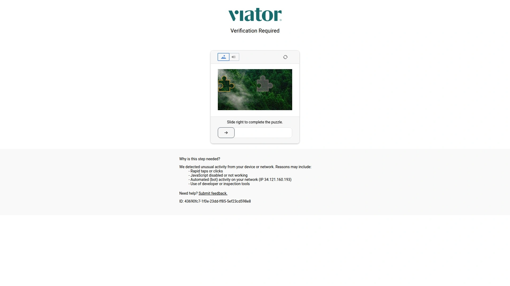

 Viator is the best place to book activities for your trip because it is owned by Tripadvisor.  It has thousands of vetted activities that you can book ahead of time, from skip-the-line tickets at the Eiffel Tower to cooking classes in Tuscany. This helps you plan your trip and avoid attractions that are already full.

 ## **[GetYourGuide](https://www.getyourguide.com)**

 A well-known place to find and book amazing travel experiences.

 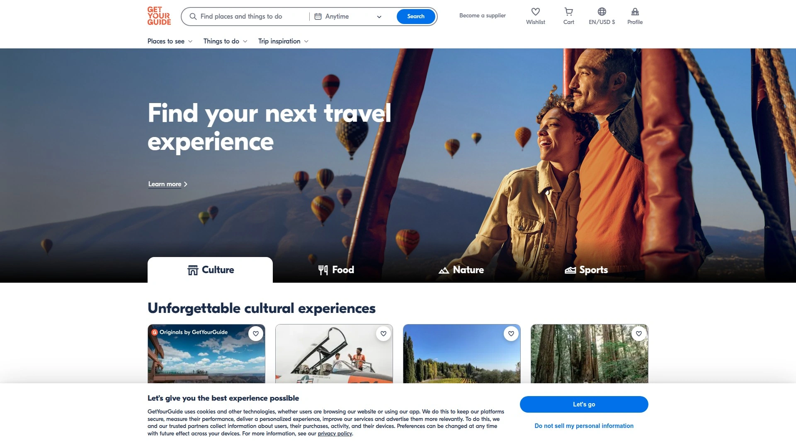

 GetYourGuide is like Viator in that it focuses on tours, trips, and things to do.  It has a mobile app that is easy to use and cancellation policies that are flexible, so you can easily plan (and change) your trips on the go.

 ## **[Klook](https://www.klook.com)**

 A popular site for booking travel services and activities, especially in Asia.

 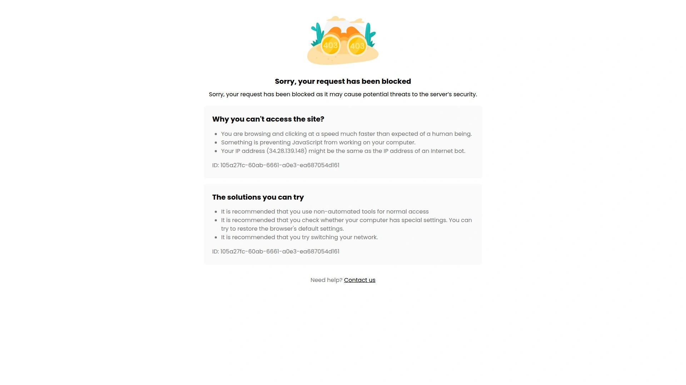

 Klook makes it easy to find and book attractions, tours, local transportation, and food experiences.  It is especially good for Asian destinations and is known for its quick confirmations and easy-to-use e-vouchers.

 ## **[eDreams](https://www.edreams.com)**

 A well-known online travel agency in Europe that sells flights, hotels, and package deals.

 This site is one of the biggest online travel companies in Europe and is part of the eDreams ODIGEO group.  It's a great way to find good flight deals and flexible packages, especially for travel within Europe.

 ## **[Hopper](https://www.hopper.com)**

 A mobile-first app that can accurately guess the prices of flights and hotels in the future.

 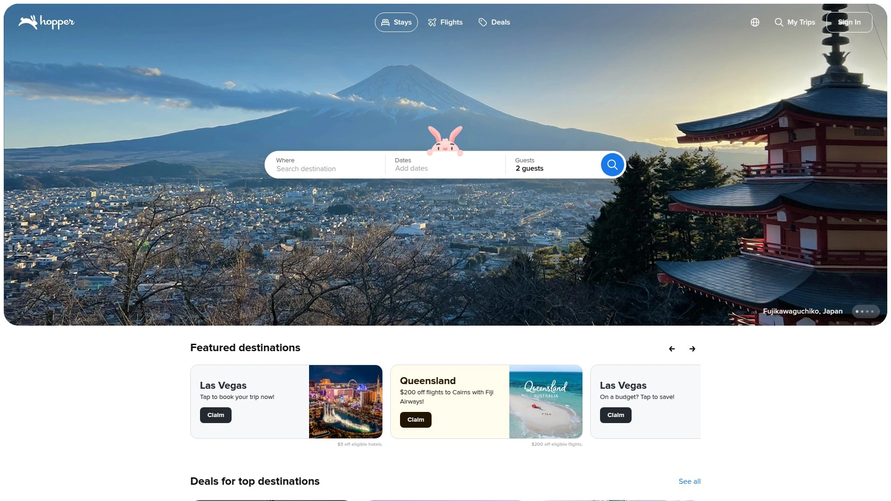

 Hopper is an AI-powered travel app that tells you when to get your tickets.  The main thing that sets it apart is its price prediction algorithm, which tells you to "buy now" or "wait for a better price."  It's a great way to get rid of the guesswork when you book.

 ## **[Google Flights](https://www.google.com/flights) / [Google Hotels](https://www.google.com/travel/hotels)**

 Google has a powerful, all-in-one search tool for flights and places to stay.

 Google's travel tools are quick, easy to use, and cover a lot of ground.  Google Flights has a simple calendar view that lets you find the cheapest dates and a map view that lets you see where you can go based on price.  It gets information from almost every airline and online travel agency, which makes it one of the best places to start looking for flights.

 ## **[Trivago](https://www.trivago.com)**

 A meta-search engine that helps you find the best hotel deals by comparing prices from a lot of booking sites.

 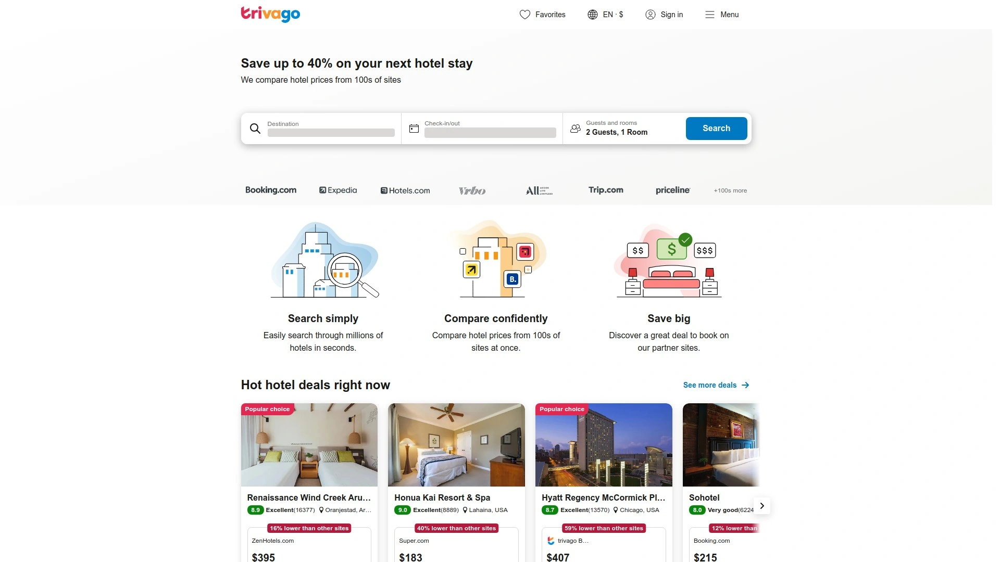

 Trivago collects hotel deals from many places, such as online travel agencies, hotel chains, and individual hotels.  Its only job is to show you the best place to book a certain hotel for the lowest price, so you don't have to check each site by hand.

 **[American Express Global Business Travel](https://www.amexglobalbusinesstravel.com/us/)**

 The best way to manage business travel.

 Amex GBT is a complete platform for managing employee travel, enforcing travel policies, and keeping costs down for businesses.  It uses cutting-edge technology and professional help to make booking for businesses easy.

 **[BCD Travel](https://www.bcdtravel.com/en-us/)**

 A travel management company that works with businesses all over the world.

 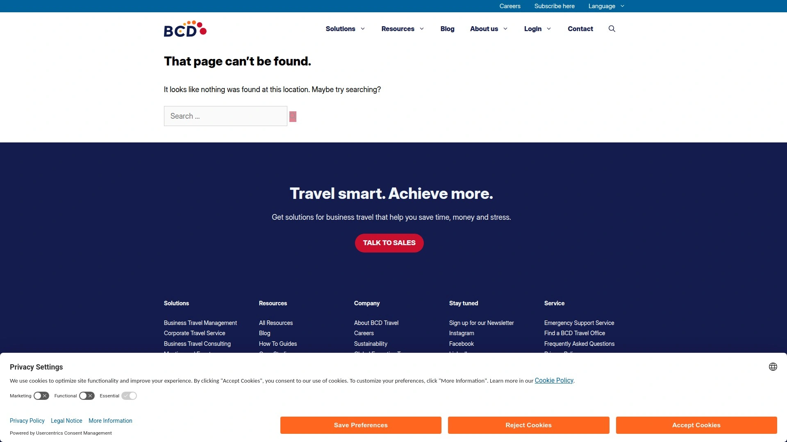

 Businesses can save money and time on business travel with the help of BCD Travel.  It is a trusted partner for businesses of all sizes because it lets people book trips, keep track of expenses, and keep travelers safe.

 **[Navan](https://navan.com/)**

 A single platform for managing business travel and expenses.

 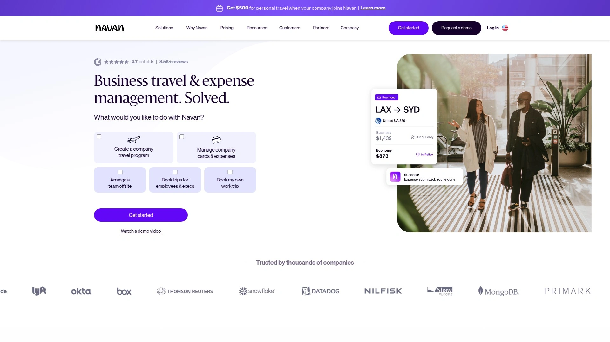

 Navan, which used to be called TripActions, is a modern, easy-to-use platform that makes business travel easier.  It lets employees book their own travel within the rules, while companies can see and control all of their spending.

 ## **[BizAway](https://bizaway.com/en/)**

 A platform for booking business trips that focuses on saving time and money.

 BizAway is a one-stop shop for managing business travel. It combines flights, hotels, trains, and rental cars into one easy-to-use platform.  It is meant to make the whole process of booking and reporting easier and more automatic.

 ***

 ### **Frequently Asked Questions**

 **How do I find the best travel booking site for my needs?**
 Think about what kind of trip you want to take.  Expedia and Travelocity are good places to look for deals that include flights and hotels.  Vrbo is the best site for vacation rentals and group trips.  Start with Booking.com for the most options for places to stay and a great loyalty program.

 **Will I really save money if I use these sites instead of booking directly?**
 Yes, a lot of the time.  These sites can access special deals and bulk pricing.   Meta-search engines like Kayak and Skyscanner are great for comparing prices to make sure you're getting the best deal online.

 **Are AI features for planning trips really useful?**
 Yes, new AI tools on sites like Booking.com can help you save a lot of time.  You can use plain language to say what you want and get quick, correct answers to specific questions about a property.

 ***

 ### **Conclusion**

 It doesn't have to be hard to book travel online.  You can plan your whole trip with confidence and ease if you use the right platform.  Booking.com is the best choice for travelers who need a comprehensive, reliable platform with the largest selection of properties worldwide. It has the most variety and the best planning tools.
